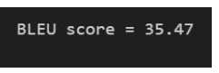
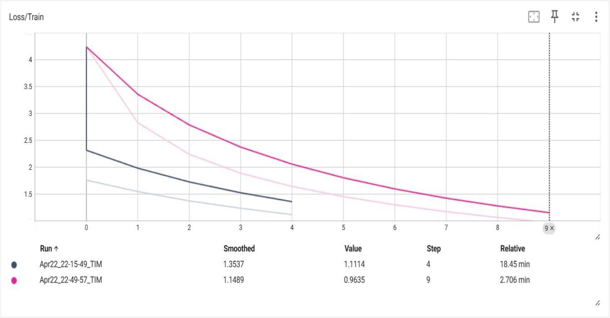
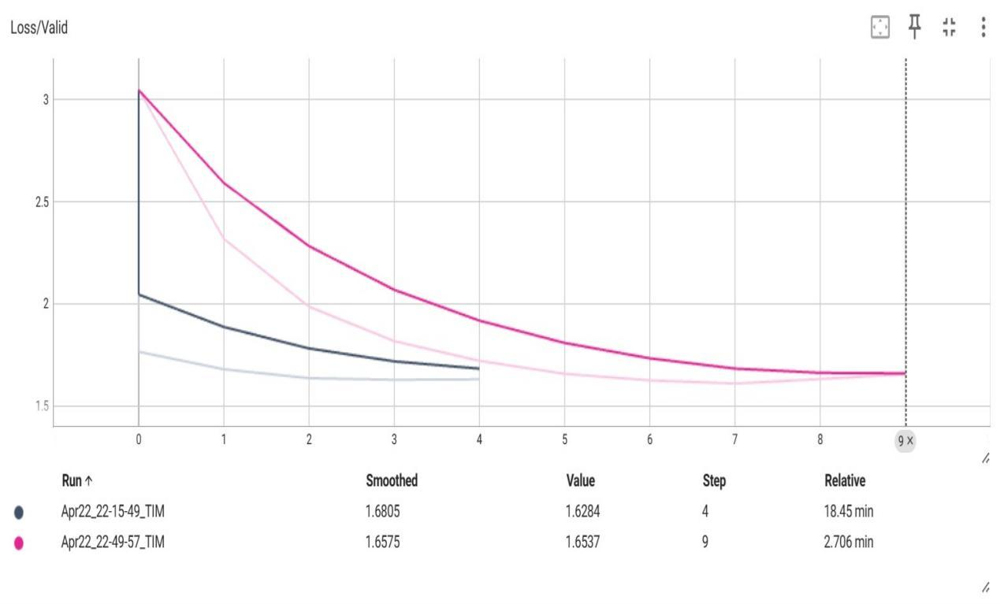
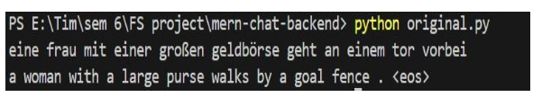
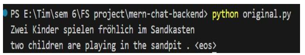

# Chat Application with Translation

## Table of Contents
1. [Overview](#overview)
2. [Features](#features)
3. [Project Structure](#project-structure)
4. [Installation](#installation)
   - [Backend Setup](#backend-setup)
   - [Frontend Setup](#frontend-setup)
5. [Tech Stack](#tech-stack)
6. [Results](#results)
7. [References](#references)
8. [Contributors](#contributors)

## Overview
This project is a **real-time chat application** with multilingual translation capabilities, built using the **MERN stack** (MongoDB, Express.js, React.js, Node.js) and **Socket.IO** for seamless communication.

## Features
- **Real-time Messaging** using WebSockets.
- **User Authentication** (Signup/Login) using JWT.
- **Multilingual Translation** using Transformer-based models.
- **User-friendly UI** with React.js.
- **MongoDB Database** for storing messages and user data.
- **BLEU Score Evaluation** for translation accuracy.

## Project Structure
```
Chat-App-With-Translator
│── Figures
│   ├── System Architecture.png
│   ├── Transformer Architecture.png
│   ├── Other architecture and system diagrams...
│
│── Results
│   ├── BLEU Scores.png
│   ├── Decoder Architecture diagrams
│   ├── Loss graphs
│   ├── Sample Predictions (1.png, 2.png)
│   ├── Sample Source and Target examples
│   ├── Attention maps
│
│── Sample Dataset
│   ├── Multilingual examples
│
│── backend
│   ├── config
│   │   ├── connection.js
│   ├── models
│   │   ├── Message.js
│   │   ├── User.js
│   ├── routes
│   │   ├── userRoutes.js
│   ├── server.js
│
│── frontend/src
│   ├── components
│   │   ├── MessageForm.js
│   │   ├── Sidebar.js
│   ├── context
│   ├── features
│   ├── pages
│   │   ├── Chats.js
│   │   ├── Home.js
│   │   ├── Login.js
│   │   ├── Signup.js
│   ├── services
│   ├── App.js
│   ├── index.js
│
│── .gitignore
│── package.json
│── README.md
```

## Installation
### Backend Setup
```sh
cd backend
npm install
npm start
```

### Frontend Setup
```sh
cd frontend
npm install
npm start
```

## Tech Stack
- **Frontend**: React.js
- **Backend**: Node.js, Express.js
- **Database**: MongoDB
- **WebSockets**: Socket.IO
- **Translation**: Transformer-based models

## Results

### BLEU Scores


### Loss Graph of Training


### Loss Graph of Validation


### Sample Prediction 1


### Sample Prediction 2


## References
- [MongoDB Documentation](https://www.mongodb.com/docs/)
- [Express.js Guide](https://expressjs.com/)
- [React.js Docs](https://reactjs.org/docs/getting-started.html)
- [Socket.IO Official Site](https://socket.io/)
- [Transformer Models](https://huggingface.co/transformers/)
- [BLEU Score Evaluation](https://machinelearningmastery.com/calculate-bleu-score-for-text-python/)

## Contributors
- **[Prasanna Venkatesh S](https://github.com/anna123venkat)**
- **[Timothy Florian](https://github.com/TimothyFlorian)**
- **[Manoj S](https://github.com/Jonam-2004)**


---

